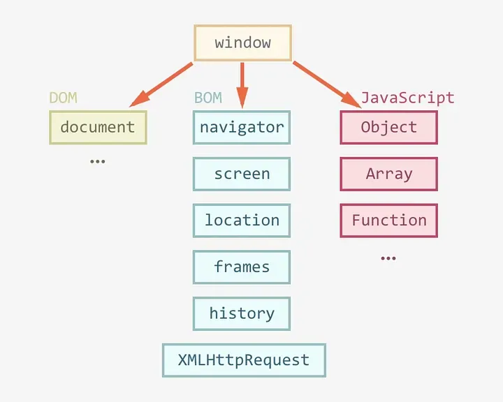

=> This blog explores the differences between Document and Window object in JavaScript, focusing on their roles, scopes, and functionalities, as they are essential components of the Document Object Model (DOM) for efficient web development.

WINDOW OBJECT

=> The Window object is a global object in client-side JavaScript, representing the browser window containing a DOM document and acting as the root of the document object model.

=> The window object, supported by all browsers, represents the browser’s window and automatically includes global JavaScript objects, functions, and variables as members.

=> The Window object is responsible for managing global variables, functions, and objects, providing methods for browser interaction and managing properties related to frames, tabs, or windows, such as alert(), confirm(), setTimeout(), and setInterval().

PROPERTIES

- window.innerHeight - the inner height of the browser window (in pixels)

- window.innerWidth - the inner width of the browser window (in pixels)

METHORDS

- window.open() - open a new window

- window.close() - close the current window

- window.moveTo() - move the current window

- window.resizeTo() - resize the current window

DOCUMENT OBJECT

=> The Document object is the HTML document that appears in the browser window and serves as an interface for interacting with the web page’s content. The browser generates a Document Object Model of a web page upon loading it.

i) The W3C Document Object Model (DOM) is a platform-neutral interface that enables dynamic access and updating of a document’s content, structure, and style by programs and scripts.

=> The DOM is a logical tree in a document, with methods allowing programmatic access to change its structure, style, or content.

PROPERTIES.

=> element.innerHTML = new html content//Change the inner HTML of an element

- element.attribute = new value//Change the attribute value of an HTML element

METHODS

- document.createElement(element//Create an HTML element

- document.removeChild(element)//Remove an HTML element

DIFFERENCE BETWEEN DOCUMENT AND WINDOW: 

_DOCUMENT_

- It represents any HTML document or web page that is loaded in the browser.
- It is loaded inside the window.
- It is the object of window property.
-  All the tags, elements with attributes in HTML are part of the document.
- We can access the document from a window using the window. document
- The document is part of BOM (browser object model) and dom (Document object model)

syntax:

      document.propertyname;

example:

     document.title :  will return the title of the document

WINDOW

- It represents a browser window or frame that displays the contents of the webpage. 
- It is the very first object that is loaded in the browser.
- It is the object of the browser.
- Global objects, functions, and variables of JavaScript are members of the window object.
- We can access the window from the window only. i.e. window.window
- The window is part of BOM, not DOM.

syntax:

    window.propertyname;

example:

    window.innerHeight : will return the height of the content area of the browser
